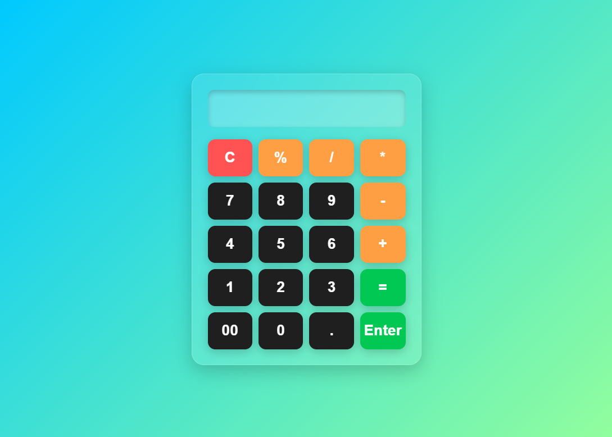

# 🧮 Simple Calculator

A responsive and visually appealing calculator built using **HTML**, **CSS**, and **JavaScript**. It supports basic arithmetic operations like addition, subtraction, multiplication, division, and percentage calculations. The UI is modern with color-coded buttons and a clean, gradient background for a better user experience. 🚀

---

## 📌 **Features**
✅ Basic arithmetic operations (+, -, *, /)  
✅ Percentage calculation  
✅ Clean and responsive design  
✅ Modern button styling with hover and click effects  
✅ 'Enter' button for quick calculation  
✅ 'C' button for clearing the display  

---

## 📸 **Screenshot**


---

## 🛠️ **Tech Stack**
- **HTML** – Structure  
- **CSS** – Styling and layout  
- **JavaScript** – Logic and interactivity  

---

## 📂 **Folder Structure**
```
├── calcy.html              # Main HTML file
├── screenshot.png          # Screenshot of calculator
├── README.md               # Project documentation
```

---

## 🚀 **Setup and Usage**
### ✅ **1. Clone the repository**:
```bash
git clone https://github.com/akashprajapaticse/Calculator.git
```

### ✅ **2. Open the HTML file**:
- Open `calcy.html` directly in your browser.  

### ✅ **3. Usage**:
1. Enter numbers using the buttons.  
2. Use `+`, `-`, `*`, `/`, and `%` for operations.  
3. Click `=` or `Enter` to calculate the result.  
4. Use `C` to clear the input.  

---

## 🎯 **How It Works**
1. `addToDisplay()` – Appends the input value to the display.  
2. `clearDisplay()` – Clears the display value.  
3. `calculateResult()` – Uses `eval()` to compute the entered expression.  

---

## 🚦 **Troubleshooting**
❗ **No Output**  
- Ensure that JavaScript is enabled in your browser.  
- Open browser console (F12) to check for errors.  

❗ **Incorrect Result**  
- Ensure proper input format (e.g., no division by zero).  

---

## 🌟 **Contributing**
1. Fork the repository.  
2. Create a new branch (`git checkout -b feature-name`).  
3. Make your changes and commit (`git commit -m 'Add new feature'`).  
4. Push to the branch (`git push origin feature-name`).  
5. Create a pull request.  

---

## 📜 **License**
This project is licensed under the **MIT License**.

---

## 👤 **Author**
👤 **Akash Prajapati** - [GitHub](https://github.com/akashprajapaticse)

---

## ⭐ **Show Your Support**
If you like this project, give it a ⭐ on GitHub!
